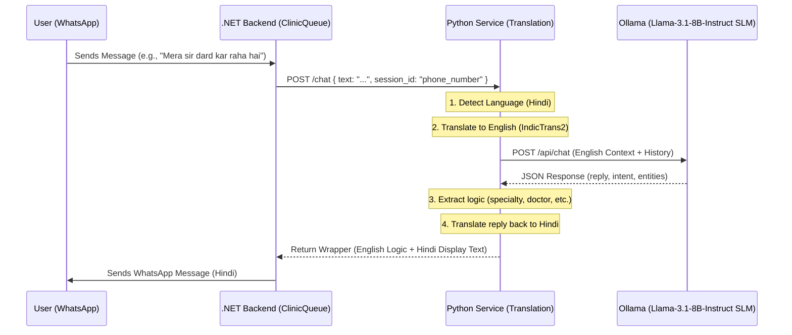

# ClinicQueue2 Project Walkthrough

This document provides a guide on how to set up and run the ClinicQueue2 project on a Windows machine, explains the current data flow (especially the SLM integration), and clarifies how questions are handled.

## 1. How to Start the Project (Windows)

To run this project on a local Windows machine, follow these steps:

### Prerequisites
- **Ollama**: [Download and install Ollama](https://ollama.com/).
- **Python 3.10+**: Ensure Python is installed and added to your PATH.
- **.NET 8.0 SDK**: Required for the backend.
- **Node.js & npm**: Required for the frontend dashboard.
- **Ngrok**: For exposing your local backend to the WhatsApp/Meta webhook.

### Step-by-Step Setup

#### A. Prepare the AI Model
Run the following command in your terminal to pull the required model for Ollama:
```powershell
ollama pull llama3.1
```

#### B. Setup the Translation Service (Python)
1. Open a terminal and navigate to the `TranslationService` directory.
2. Create a virtual environment:
   ```powershell
   python -m venv venv
   ```
3. Activate the virtual environment:
   ```powershell
   .\venv\Scripts\activate
   ```
4. Install dependencies:
   ```powershell
   pip install -r requirements.txt
   ```
5. Run the service:
   ```powershell
   python main.py
   ```
   *(The service usually runs on http://localhost:8000)*

#### C. Setup the Backend (.NET)
1. Open a new terminal and navigate to the `ClinicQueue` directory (the one containing `ClinicQueue.csproj`).
2. Run the project:
   ```powershell
   dotnet run
   ```
   *(The backend usually runs on http://localhost:5000)*

#### D. Setup the Frontend (Vite)
1. Open a new terminal and navigate to `ClinicQueue/frontend`.
2. Install dependencies:
   ```powershell
   npm install
   ```
3. Start the dev server:
   ```powershell
   npm run dev
   ```

#### E. Setup WhatsApp Webhook (Ngrok)
1. Start Ngrok to tunnel your backend port:
   ```powershell
   ngrok http 5000
   ```
2. Copy the **Forwarding** HTTPS URL (e.g., `https://abc-123.ngrok-free.dev`).
3. Update your Webhook URL in the [Meta Developer Portal](https://developers.facebook.com/):
   - **Callback URL**: `https://YOUR-URL.ngrok-free.dev/api/whatsapp/webhook`
   - **Verify Token**: (As configured in `appsettings.json`, default is `VERIFY_TOKEN`)

> [!TIP]
> Use the provided `ClinicQueue/START-ALL.ps1` PowerShell script to launch all services automatically in separate windows.

---

## 2. Current Flow of Data (WhatsApp & SLM)

The system is designed to handle multilingual conversations (especially Hinglish) using a combination of a .NET orchestrator, a Python translation service, and an SLM.

### Data Flow Diagram


### SLM Integration Details
- **Model**: Uses `llama3.1` (Llama-3.1-8B-Instruct) via Ollama for lightweight, high-quality reasoning.
- **Service Responsibility**: The Python `TranslationService` acts as a middleman. It ensures that the SLM only "sees" English, which improves accuracy for complex medical extraction, while the user perceives a native language experience.
- **State Management**: Session history is maintained in the Python service to allow multi-turn conversations (triage questions).

---

## 3. Are the Questions Hardcoded?

**No, the questions are NOT hardcoded.**

The AI assistant's conversation logic is driven by a **System Prompt** located in `TranslationService/main.py`. Instead of a static list of questions, the SLM (Llama-3.1-8B-Instruct) follows these instructions:

1. **Triage Strategy**: The prompt instructs the AI to "Perform triage by asking 3-4 medically relevant follow-up questions" once symptoms are provided.
2. **Context-Awareness**: The AI generates questions dynamically based on the specific symptoms the user mentions (e.g., if you say "fever", it might ask about duration or other symptoms like cough).
3. **Dynamic Guidance**: The SLM is also responsible for recommending a specialty from a provided list and suggesting doctors, negotiating dates/times, and confirming details—all in a natural, conversational way.

> [!IMPORTANT]
> While the *questions* are dynamic, the *possible outputs* (Specialties and Doctors) are constrained to the lists defined in the code to ensure the AI doesn't hallucinate non-existent clinic services.
